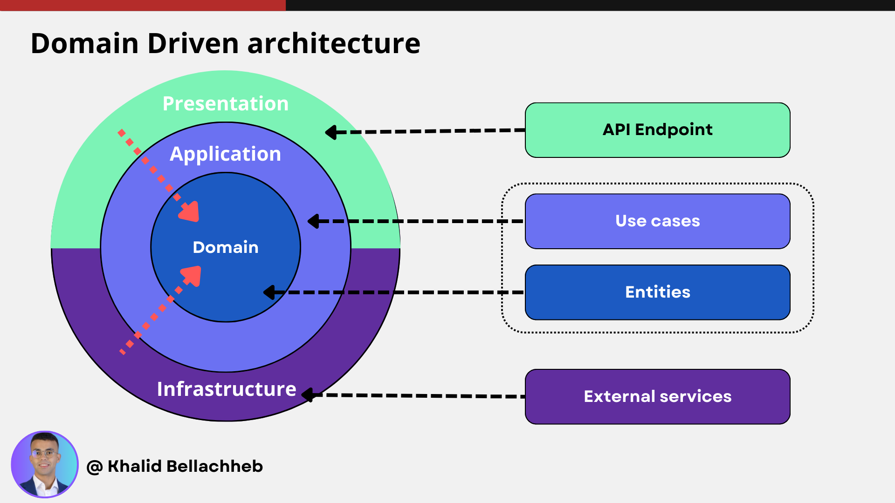
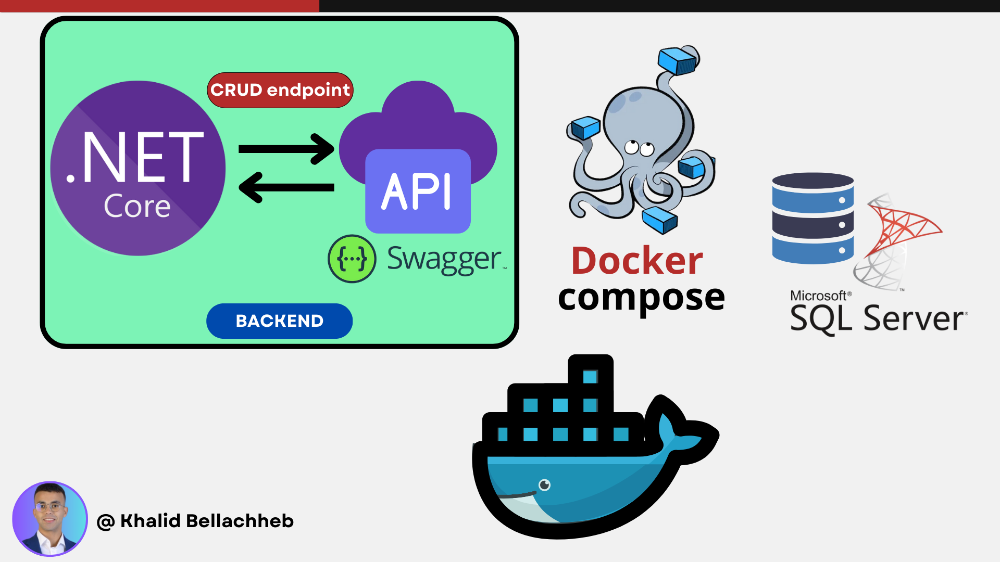

**Expenses Management API**
===========================

**Project Overview**
--------------------

The Expenses Management API is a backend service built using ASP.NET Core (.NET 8) to manage user expenses. It supports CRUD (Create, Retrieve, Update, Delete) operations for expenses and is structured using Domain-Driven Design (DDD). The project utilizes Entity Framework Core with SQL Server for data storage and is containerized using Docker for ease of development and deployment.

### Domain-Driven Design (DDD)


### Project Architecture


**Features**
------------

* **CRUD Operations for Expenses**: Create, retrieve, update, and delete expenses with validation rules.
* **User Management**: Pre-initialized users with specific currencies.
* **Expense Validation Rules**: Ensuring data integrity and business logic compliance.
* **Sorting and Listing**: List expenses by user with sorting options.
* **API Documentation**: Interactive documentation using Swagger UI.
* **Docker Integration**: Simplified setup and deployment.

**Project Requirements Fulfillment**
------------------------------------

### **Resources**

#### **Expenses**

An expense includes:

* **User**: The person who made the purchase.
* **Date**: The date of the expense.
* **Type**: One of the following - Restaurant, Hotel, or Misc.
* **Amount and Currency**: The monetary value and its currency.
* **Comment**: Additional details about the expense.

#### **Users**

A user includes:

* **First Name and Last Name**: Personal identification.
* **Currency**: The default currency for their expenses.

### **Main Features Implemented**

#### **Creating an Expense**

The API allows creating an expense while enforcing the following validation rules:

* **Future Date Prohibition**: Expenses cannot have a future date.
* **Date Range Limit**: Expenses cannot be dated more than 3 months ago.
* **Mandatory Comment**: Every expense must include a comment.
* **Duplicate Expense Prevention**: Users cannot declare the same expense twice (same date and amount).
* **Currency Match Enforcement**: The expense currency must match the user's currency.

#### **Listing Expenses**

The API provides endpoints to:

* **List Expenses by User**: Retrieve expenses for a specific user.
* **Sorting**: Sort expenses by amount or date.
* **Comprehensive Display**: Show all expense properties, displaying the user's name in the format "FirstName LastName" (e.g., "Anthony Stark").

### **Additional Information**

* **Authentication**: Not implemented, as per the requirements.
* **User Interface**: Not developed, focusing solely on the backend API.

**Technology Stack**
--------------------

* **C# / .NET 8**: Core language and framework.
* **Entity Framework Core**: ORM for database operations.
* **SQL Server**: Relational database for data persistence.
* **Docker**: Containerization for both the API and the database.
* **Swagger**: Interactive API documentation.

**Getting Started**
-------------------

### **Prerequisites**

* **.NET 8 SDK**: To build and run the application.
* **Docker Desktop**: For running the application in containers.
* **Visual Studio 2022 or later**: Recommended IDE.
* **SQL Server Management Studio**: Optional, for direct database access.

### **Setup Instructions**

1. **Clone the Repository**:
    
    ```bash
    git clone <repository_url>
    ```
    
2. **Navigate to the Project Directory**:
    
    ```bash
    cd ExpensesAPI
    ```
    
3. **Build and Run the Docker Containers**:
    
    ```bash
    docker-compose up --build
    ```
    
4. **Database Initialization**:
    
    The database is automatically initialized with the following users:
    
    * **Anthony Stark**: Currency - U.S. Dollar (USD)
    * **Natasha Romanova**: Currency - Russian Ruble (RUB)
5. **Access the API Documentation**:
    
    Open your browser and navigate to `http://localhost:<port>/swagger` to explore and test the API endpoints.
    

**Usage**
---------

### **Creating an Expense**

To create an expense, send a POST request to `/api/expenses` with the following JSON body:

```json
{
  "userId": "<user_id>",
  "date": "YYYY-MM-DD",
  "type": "Restaurant | Hotel | Misc",
  "amount": <amount>,
  "currency": "<currency_code>",
  "comment": "Your comment here"
}
```

**Note**: Ensure that all validation rules are met to successfully create an expense.

### **Listing Expenses**

To list expenses for a user:

* **Endpoint**: `GET /api/expenses/user/{userId}`
* **Optional Query Parameters**:
    * `sortBy`: `amount` or `date`
    * `order`: `asc` or `desc`

**Example**:

```bash
GET /api/expenses/user/1?sortBy=date&order=asc
```

**Testing**
-----------

* **Unit Tests**: The project includes unit tests for all expense validation rules located in the `ExpensesAPI.Tests` project.
    
* **Running Tests**:
    
    ```bash
    dotnet test
    ```
    

**Performance Considerations**
------------------------------

* **Optimized Queries**: Implemented efficient querying with Entity Framework Core to ensure fast data retrieval.
* **Asynchronous Operations**: Used async/await patterns to keep the application responsive.

**Authors**
-----------

* **Khalid Bellachheb** - Initial development and implementation.

**License**
-----------

This project is licensed under the MIT License - see the LICENSE.md file for details.
